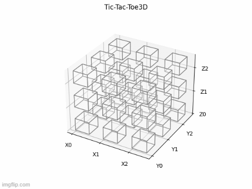

# gym-tic-tac-toe3D
-------------------
OpenAI Gym Environment for a Two-Player 3D Tic-Tac-Toe.
Github Link: https://github.com/OUStudent/gym_tic_tac_toe3D

# Requirements
----------------
- gym
- Numpy
- Matplotlib

# Install
----------------------
```python
pip install gym-tic-tac-toe3D
```
# How it Works
Tic Tac Toe is usually played on a 3x3 grid where the objective is for one player to line up their tokens in a straight 
line of three. This is an extremely easy and trivial game; however, one can extend the difficulty by stacking 3x3 layers 
to create a 3x3x3 cube. Now the objective is to line up three tokens in any of the directions. 

Here are three example games where the action was randomly generated:




# How to Use

The environment is a Two-Player Game, where Blue denotes Player 1 and Red denotes Player 2. The `state` and `action`  
contains all 27 possible positions, 9 for the first layer, 9 for the second, and 9 for the third.

The input has three possible integer values for eac position, -1 for opponent, 0 for empty, and 1 for current player. 
Note that no matter whom the Player is, these values holds true. The `reward` is a two value list where the first index 
represents the reward for Player 1 and the second for Player 2. The `reward` value should only be used after the game is 
completed. Players are rewarded for wins and receive extra points for how fast they win; while players are penalized for 
losing and how fast they lost. In addition, because Player 1 has such a great advantage over Player 2 due to playing first,
they are penalized greater if they lose to Player 2 than if Player 2 lost to Player 1; in addition, Player 2 is rewarded
greater than Player 1 if they win than if Player 1 won against Player 2. Here are the current rewards:

| Turns Taken  | Player 1 Win:  | P1 Reward  | P2 Penalize  | Player 2 Win:  | P1 Penalize | P2 Reward |
|---|---|---|---|---|---|---|
| <= 3  | 1   |  20 | -10  | 2  | -20|     40 |
| <=5  |  1 |  18 |  -9 |  2 |   -18 | 36  |
| <=7  |  1 |  16 |  -8 |  2 |   -16 |  32 |
| <=9  |  1 |  14 | -7  |  2 |  -14  |  28 |
| Else  | 1  | 10  |  -5 | 2  |  -10  |  20 |

For example, after a game where Player 1 has won within three turns, Player 1 is rewarded 20 points while Player 2 penalized
10 points. On the other hand, if Player 2 won within 7 turns then Player 1 is penalized 16 points while Player 2 is 
rewarded 32 points. 

Here is an example on how to create the environment with random agents:

```python
import gym
import gym_tic_tac_toe3D
import matplotlib.pyplot as plt

env = gym.make("tic_tac_toe3D-v0")

games = 3  # best of three
player1_reward = 0
player2_reward = 0
for i in range(0, games):
    state = env.reset()
    done = False
    player = 1
    while not done:
        env.render(player=player)
        plt.pause(0.5)
        while True:
            action = env.action_space.sample()
            # Need to check if action is available in state space
            if state[action] == 0:
                break

        state, reward, done, info = env.step(action, player=player)
        # switch players
        if player == 1:
            player = 2
        else:
            player = 1
    # final render after completion of game to see final move
    env.render(player=player)
    plt.pause(1)
    player1_reward += reward[0]
    player2_reward += reward[1]
```

Here is another example between two agents named `p1` and `p2`:

```python
import gym
import gym_tic_tac_toe3D
import matplotlib.pyplot as plt

def play(p1, p2, show=False, num_games=3):
    env = gym.make("tic_tac_toe3D-v0")
    player1_reward = 0
    player2_reward = 0
    for i in range(0, num_games):
        state = env.reset()
        done = False
        player = 1
        while not done:
            if show:
                env.render(player=player)
                plt.pause(0.5)
            if player == 1:
                move = p1.predict(state)  # returns softmax of prob's for all 27 possible actions
            else:
                move = p2.predict(state)  # returns softmax of prob's for all 27 possible actions
            # get action states that are emtpy
            viable_moves = np.where(state == 0)[0].tolist()
            # find the empty action with the largest probability
            action = viable_moves[np.argmax(move[0][viable_moves])]
            
            state, reward, done, info = env.step(action, player=player)
            # switch players
            if player == 1:
                player = 2
            else:
                player = 1
        if show:
            env.render(player=player)
            plt.pause(1)
        player1_reward += reward[0]
        player2_reward += reward[1]
    return player1_reward, player2_reward
```

# Custom Rewards

If the default rewarding scheme described above does not suite your likings, there is an option to create custom
rewarding. The rewards available for changing are only for the turn slots described above, meaning `[3,5,7,9,else]` for 
rewarding or penalizing players 1 and 2. Here is an example:

Suppose I want the following rewarding scheme:

| Turns Taken  | Player 1 Win:  | P1 Reward  | P2 Penalize  | Player 2 Win:  | P1 Penalize | P2 Reward |
|---|---|---|---|---|---|---|
| <= 3  | 1   |  20 | -2  | 2  | -20|     40 |
| <=5  |  1 |  18 |  -4 |  2 |   -16 | 30  |
| <=7  |  1 |  12 |  -6 |  2 |   -12 |  20 |
| <=9  |  1 |  8 | -8  |  2 |  -10  |  10 |
| Else  | 1  | 5  |  -10 | 2  |  -10  |  10 |

Then this is how to create it:

```python
import gym
import gym_tic_tac_toe3D

cust_p1_win = [20, 18, 12, 8, 5]
cust_p2_win = [40, 30, 20, 10, 10]
cust_p1_lose = [-20, -16, -12, -10, -10]
cust_p2_lose = [-2, -4, -6, -8, -10]

env = gym.make("tic_tac_toe3D-v0")
env.custom_rewards(reward_p1=cust_p1_win, reward_p2=cust_p2_win,
                   pen_p1=cust_p1_lose, pen_p2=cust_p2_lose)
# do other stuff
```
